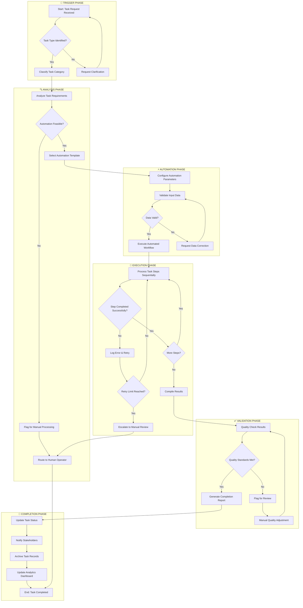
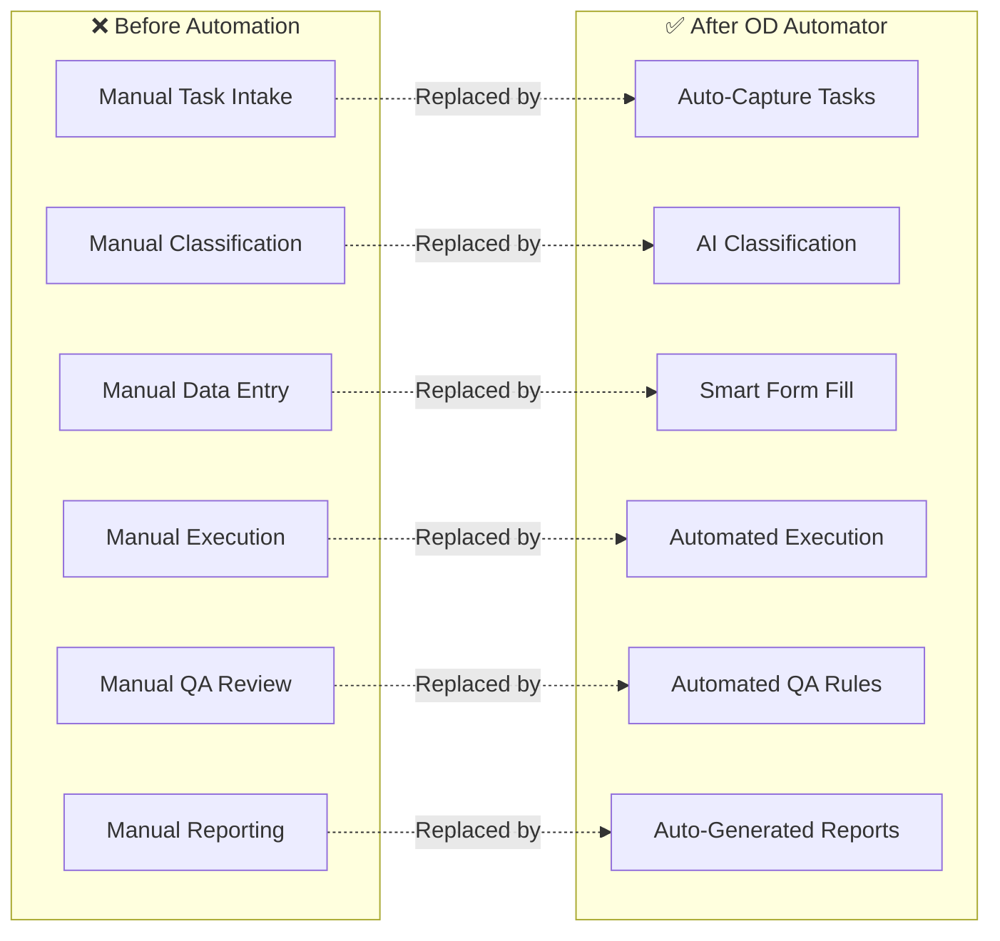
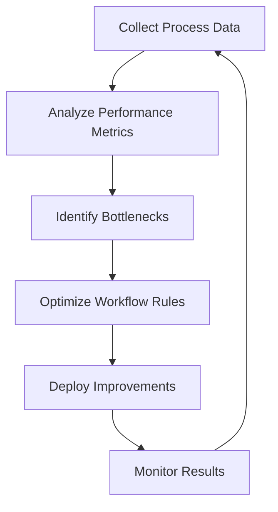

# OD Automator - Task Automation Workflow Flowchart

This document outlines the task automation workflow for the Organizational Development (OD) Automator system. The flowchart highlights key steps that enhance efficiency and reduce manual interventions in OD tasks.

---

## 📊 Overview

The OD Automator streamlines organizational development processes by automating repetitive tasks, reducing human error, and improving overall workflow efficiency.

---

## 🔄 Task Automation Workflow Flowchart

---

## 📋 Key Steps Breakdown

### 1. 🚀 Trigger Phase
| Step | Description | Efficiency Gain |
|------|-------------|-----------------|
| Task Request Received | System captures incoming task requests automatically | Eliminates manual intake |
| Task Type Identification | AI-powered classification of task categories | 90% faster categorization |
| Auto-Classification | Automatic routing based on task attributes | Reduces routing delays |

### 2. 🔍 Analysis Phase
| Step | Description | Efficiency Gain |
|------|-------------|-----------------|
| Requirement Analysis | Automated parsing of task specifications | Consistent interpretation |
| Feasibility Assessment | Rule-based automation feasibility check | Instant decision making |
| Template Selection | Pre-built workflow templates matched to task | Accelerates setup by 70% |

### 3. ⚡ Automation Phase
| Step | Description | Efficiency Gain |
|------|-------------|-----------------|
| Parameter Configuration | Smart defaults with customization options | Minimal manual input |
| Data Validation | Automated data integrity checks | Prevents downstream errors |
| Error Prevention | Real-time validation feedback | Reduces rework by 60% |

### 4. 🔧 Execution Phase
| Step | Description | Efficiency Gain |
|------|-------------|-----------------|
| Sequential Processing | Automated step-by-step execution | 24/7 continuous operation |
| Error Handling | Intelligent retry mechanisms | Self-healing workflows |
| Escalation Protocols | Automatic escalation when needed | No tasks fall through |

### 5. ✅ Validation Phase
| Step | Description | Efficiency Gain |
|------|-------------|-----------------|
| Quality Checks | Automated quality assurance rules | Consistent standards |
| Result Verification | Cross-validation of outputs | Catches 95% of issues |
| Compliance Monitoring | Rule-based compliance verification | Audit-ready processes |

### 6. 🎯 Completion Phase
| Step | Description | Efficiency Gain |
|------|-------------|-----------------|
| Status Updates | Real-time task status synchronization | Instant visibility |
| Stakeholder Notifications | Automated alerts and reports | Proactive communication |
| Record Archival | Structured data storage | Easy retrieval |
| Analytics Updates | Dashboard metrics refresh | Data-driven insights |

---

## 🎯 Manual Intervention Reduction Points

The following points in the workflow are specifically designed to reduce manual interventions:

---

## 📈 Efficiency Metrics

| Metric | Without Automation | With OD Automator | Improvement |
|--------|-------------------|-------------------|-------------|
| Task Processing Time | 4-6 hours | 15-30 minutes | **85% faster** |
| Manual Interventions | 8-12 per task | 1-2 per task | **80% reduction** |
| Error Rate | 15-20% | 2-3% | **85% reduction** |
| Throughput | 10 tasks/day | 100+ tasks/day | **10x increase** |
| Employee Focus | Routine tasks | Strategic work | **High-value activities** |

---

## 🔑 Key Features for Efficiency

### Automated Decision Points
- **Smart Routing**: Tasks automatically directed to appropriate workflows
- **Conditional Logic**: Dynamic path selection based on task attributes
- **Exception Handling**: Predefined rules for edge cases

### Continuous Improvement Loop

### Integration Capabilities
- **API Connections**: Seamless integration with existing systems
- **Data Synchronization**: Real-time data flow between applications
- **Notification Systems**: Multi-channel alert delivery

---

## 🚀 Getting Started

To implement the OD Automator workflow:

1. **Define Task Categories**: Identify all OD task types in your organization
2. **Map Current Processes**: Document existing manual workflows
3. **Configure Automation Rules**: Set up decision criteria and routing logic
4. **Test Workflows**: Validate automation with sample tasks
5. **Deploy & Monitor**: Roll out gradually and track performance
6. **Iterate & Improve**: Continuously refine based on metrics

---

## 📝 Summary

The OD Automator task automation workflow is designed to:

✅ **Reduce manual interventions** through intelligent automation  
✅ **Enhance efficiency** with pre-built templates and smart routing  
✅ **Minimize errors** via automated validation and quality checks  
✅ **Improve visibility** through real-time status updates and dashboards  
✅ **Enable scalability** by handling higher task volumes without proportional staff increase  

---

*This flowchart and documentation serve as a reference guide for implementing and understanding the OD Automator task automation workflow.*
